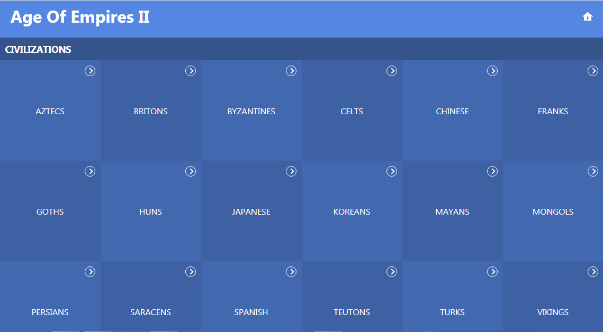

# Age Of Empires II

## Catalogue of Statistics

> A react single page application to show information on the civilizations included in the video game 'Age Of Empires II'. The data used in this project is sourced from the API [age-of-empires-2-api.herokuapp.com/](https://age-of-empires-2-api.herokuapp.com/docs/). The project demostrates routing in react spa, redux store and integrating API calls in redux reducers.



## Built With

- React
- Redux

## Live Demo

[demo](https://chass-empires.herokuapp.com/)

## Getting Started

To get a local copy up and running follow these simple example steps on the command line.

```bash

  # Clone the project from it's github repo.

  $ git clone https://github.com/chasscepts/empires

  # Change directory to the root of project

  $ cd empires

  # Install all dependencies

  $ npm install

  # Open app in your local browser

  $ npm run start

  # To run the tests

  $ npm run test

  # To build the project for production

  $ npm run build

```

## Authors

👤 **Obetta Francis**

[](https://github.com/chasscepts) [](https://twitter.com/chasscepts) [](https://www.linkedin.com/in/chasscepts/)

## 🤝 Contributing

Contributions, issues, and feature requests are welcome!

Feel free to check the [issues page](https://github.com/chasscepts/empires/issues).

## Show your support

Give a ⭐️ if you like this project!

## Acknowledgments
- Design idea by [Nelson Sakwa on Behance](https://www.behance.net/sakwadesignstudio)
- [Official Game Site](https://www.ageofempires.com/games/aoeiide/)
- [Data Source](https://age-of-empires-2-api.herokuapp.com/docs/)
- Background Image by [Mathilde Normandeau](https://unsplash.com/@mathildeeee?utm_source=unsplash&utm_medium=referral&utm_content=creditCopyText) on [Splash](https://unsplash.com/s/photos/blue?utm_source=unsplash&utm_medium=referral&utm_content=creditCopyText)
- Icon by [Dorsa Masghati](https://unsplash.com/@dorsamasghati?utm_source=unsplash&utm_medium=referral&utm_content=creditCopyText) on [Splash](https://unsplash.com/s/photos/blue?utm_source=unsplash&utm_medium=referral&utm_content=creditCopyText)
- Microverse Community
- Everyone whose code was used in this project

## 📝 License

This project is [MIT](./LICENSE)
